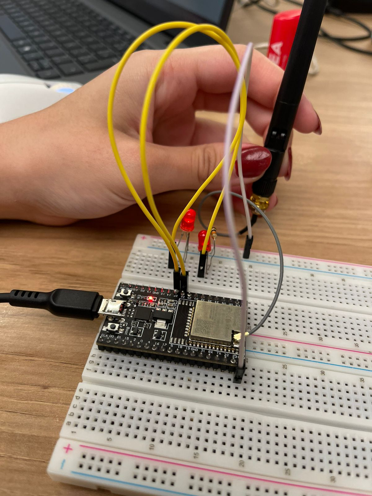
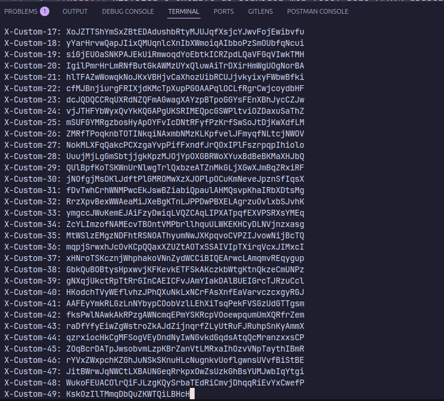
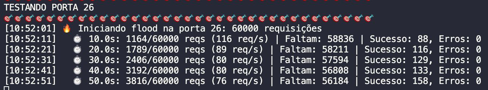

# Análise de Segurança em Servidor Web ESP32

**Feito por**: 
- [Daniel Guilguer](https://github.com/DanGuilger)
- [Davi Duarte](https://github.com/Yuhtin)
- [Guilherme Hassenpflug](https://github.com/guihassen)
- [Marcos Marcondes](https://github.com/MZMS1510)
- [Maria Clara Oliveira](https://github.com/slaywithoutd)
- [Pedro Siqueira](https://github.com/pesiqueiraa)
- [Rayssa Guedes](https://github.com/guedesrayssa)

&ensp;Este projeto apresenta uma análise completa de segurança (estática e dinâmica) de um servidor web embarcado no ESP32, identificando vulnerabilidades críticas e demonstrando exploits práticos através de testes automatizados.

## Objetivo

&ensp;O objetivo deste projeto é realizar uma análise de segurança abrangente em um servidor web IoT, desenvolvendo competências em:

- **Análise estática de código** para identificação de vulnerabilidades;
- **Testes dinâmicos** com exploits reais e automatizados;
- **Avaliação de riscos** utilizando matrizes de probabilidade e impacto;
- **Desenvolvimento de contramedidas** para mitigação de ataques;
- **Documentação técnica** de processos de segurança em sistemas embarcados.

## Descrição Geral do Projeto

&ensp;O projeto foi desenvolvido utilizando como base um servidor web simples para ESP32 que controla GPIOs via HTTP. Através de análise estática do código, foram identificadas múltiplas vulnerabilidades críticas que permitem diferentes tipos de ataques.

&ensp;Para validar as vulnerabilidades encontradas, foram desenvolvidos scripts Python automatizados que executam ataques reais contra o dispositivo, demonstrando na prática as falhas de segurança e coletando evidências dos impactos.

&ensp;O projeto combina documentação teórica detalhada com testes práticos, resultando em uma análise completa do estado de segurança do sistema e recomendações concretas de mitigação.

## Estrutura do Projeto

```
pond-comp-sem-9/
├── README.md                  # Este arquivo
├── SECURITY_ISSUES.md         # Análise detalhada de vulnerabilidades
├── images/                    # Evidências visuais dos testes
│   ├── prototipo-fisico-montado.png
│   ├── terminal-esp-teste-headerflood.png
│   └── testando-ataque-flood.png
├── scripts/                   # Scripts de teste automatizados
│   ├── esp32_security_test.py
│   └── esp32_aggressive_test.py
├── src/                       # Código-fonte do servidor web ESP32
│   └── main.cpp
├── include/                   # Arquivos de cabeçalho
├── lib/                       # Bibliotecas auxiliares
├── test/                      # Testes e validação
└── platformio.ini            # Configuração do PlatformIO
```

## Análise de Segurança

**Foco**: Identificação e análise de vulnerabilidades em um servidor web embarcado.

**Documentação**: [SECURITY_ISSUES.md](./SECURITY_ISSUES.md)

**Descrição**: Análise estática de código para identificar vetores de ataque e avaliar riscos em um servidor web ESP32, incluindo vulnerabilidades como buffer overflow, path injection e ataques de negação de serviço.

**Recursos Adicionais**:
- [Matriz de Riscos de Segurança (Google Sheets)](https://docs.google.com/spreadsheets/d/1pOvaMNo5Gc_XZG_BOW_zx57ENu1-3RO7t-l1jCJIgSs/edit?gid=1832854299#gid=1832854299)
- [Apresentação do Projeto (Canva)](https://www.canva.com/design/DAG7HWB6oa8/jQNiINKRaSCQhQFjlHdxHA/edit?utm_content=DAG7HWB6oa8&utm_campaign=designshare&utm_medium=link2&utm_source=sharebutton)

#### Montagem Física do Protótipo

&ensp;O protótipo foi montado em protoboard para realizar os testes dinâmicos de segurança, permitindo a execução real dos ataques identificados na análise estática.

<div align="center">
	<sup>Figura 1 - Protótipo físico montado para testes de segurança</sup></br>
	</br>
	<sup>Fonte: Própria</sup></br>
</div>

#### Testes de Segurança Realizados

&ensp;Após a análise estática, foram realizados testes dinâmicos para validar as vulnerabilidades identificadas. Os seguintes ataques foram executados:

| # | Tipo de Ataque | Descrição |
| - | -------------- | --------- |
| 1 | **Buffer Overflow** | Envia headers HTTP gigantes (10KB+) para estourar a String header |
| 2 | **Slowloris** | Mantém 30+ conexões abertas enviando dados lentamente (explora timeout de 2000ms) |
| 3 | **Rapid Flooding** | Força o ESP32 a gerar HTML pesado repetidamente |
| 4 | **Path Injection** | URLs malformadas com 5000+ caracteres para travar o indexOf() |
| 5 | **Combined Attack** | Todos os ataques simultaneamente |

#### Vulnerabilidades Exploradas

&ensp;Durante os testes, as seguintes vulnerabilidades foram confirmadas:

1. **String header sem limite** - permite buffer overflow
2. **Timeout generoso (2000ms)** - facilita ataques slowloris
3. **Processamento pesado de HTML** - vulnerável a flooding
4. **indexOf sem validação** - permite path injection
5. **Ausência de proteção contra ataques multi-vetor** - permite ataque combinado

#### Resultados dos Testes

<div align="center">
	<sup>Figura 2 - Terminal do ESP32 durante teste de Header Flood</sup></br>
	</br>
	<sup>Fonte: Própria</sup></br>
</div>

&ensp;Os testes foram executados através de um script automatizado que realizou os 5 tipos de ataques sequencialmente:

<div align="center">
	<sup>Figura 3 - Execução do script de testes de ataque</sup></br>
	</br>
	<sup>Fonte: Própria</sup></br>
</div>

**Estatísticas dos Testes:**

```
======================================================================
📊 RELATÓRIO DE EXPLOITS
======================================================================
Buffer Overflow attempts: 69
Slowloris conexões: 30
Rapid requests: 186
Crashes detectados: 3
======================================================================
```

&ensp;Os resultados demonstram que o ESP32 é altamente vulnerável aos ataques testados, com **3 crashes completos** detectados durante a execução dos exploits, confirmando a criticidade das vulnerabilidades identificadas.

#### Recomendações de Segurança

&ensp;Com base nos testes realizados, as seguintes medidas de mitigação são recomendadas:

| # | Mitigação | Implementação |
| - | --------- | ------------- |
| 1 | **Limitar tamanho de header** | `if (header.length() > 512) break;` |
| 2 | **Reduzir timeout** | `const long timeoutTime = 500;` |
| 3 | **Rate limiting por IP** | Controlar requisições por endereço de origem |
| 4 | **Validar URLs** | Verificar tamanho e caracteres antes de processar |
| 5 | **Autenticação** | Implementar Basic Auth no mínimo |
| 6 | **CSRF Token** | Adicionar tokens para prevenir CSRF |
| 7 | **Limitar conexões simultâneas** | Máximo de 5-10 conexões ativas |

&ensp;A implementação dessas medidas reduziria significativamente a superfície de ataque do servidor web ESP32, tornando-o mais resistente a tentativas de exploração.

#### Scripts de Teste de Segurança

&ensp;Para realizar os testes dinâmicos de segurança, foram desenvolvidos dois scripts Python automatizados localizados na pasta `/scripts`:

##### 1. esp32_security_test.py - Bateria Completa de Testes

&ensp;Script principal que executa uma bateria completa de testes de segurança de forma sequencial e organizada.

**Funcionalidades:**
- **Teste de Conectividade Básica** - Verifica responsividade do servidor com requisições simples
- **Flood de Requisições (DoS)** - Envia múltiplas requisições simultâneas para testar resiliência
- **Teste de Payloads Grandes** - Testa buffers com payloads de 100 bytes até 100KB
- **Requisições Malformadas** - Envia payloads com caracteres especiais, path traversal, SQL injection, XSS, null bytes
- **Rate Limiting** - Verifica se o sistema possui proteção contra requisições em alta velocidade
- **Múltiplas Portas** - Testa simultaneamente diferentes portas GPIO do ESP32

**Exemplo de Uso:**

```bash
cd scripts
python3 esp32_security_test.py
```

**Configurações:**

```python
TARGET_IP = "http://10.128.0.201"  # IP do ESP32
TIMEOUT = 5                         # Timeout em segundos
NUM_THREADS = 10                    # Threads concorrentes
MAX_PAYLOAD_SIZE = 10000           # Tamanho máximo de payload
```

**Saída do Script:**
- Logs detalhados com timestamp de cada teste
- Contadores de sucesso, falhas e timeouts
- Relatório final com estatísticas completas
- Lista de erros únicos detectados

##### 2. esp32_aggressive_test.py - Teste de Stress Extremo

&ensp;Script de teste agressivo que simula um ataque DoS real com alta intensidade de requisições.

**Características:**
- 🎯 **60.000 requisições totais** - Teste de 1 minuto a ~1000 req/s
- 🔄 **Alternância inteligente** - Alterna entre portas GPIO (26↔27) e comandos (on↔off)
- ⚡ **Alta concorrência** - Utiliza 1000 workers simultâneos
- 📊 **Monitoramento em tempo real** - Logs a cada 10 segundos com estatísticas de progresso
- 🔍 **Detecção de crashes** - Identifica quando o ESP32 para de responder

**Exemplo de Uso:**

```bash
cd scripts
python3 esp32_aggressive_test.py
```

**Configurações:**

```python
TARGET_IP = "http://10.128.0.201"   # IP do ESP32
TOTAL_REQUESTS = 60000              # Total de requisições (1 min × 1000 req/s)
REQUEST_RATE = 1000                 # Taxa alvo: 1000 requisições/segundo
PORTS_TO_TEST = [26, 27]           # Portas GPIO para alternar
```

**Métricas Reportadas:**
- Taxa média de requisições por segundo (req/s)
- Porcentagem de sucesso vs. falhas
- Timeouts e conexões recusadas (indicam possível crash)
- Distribuição de códigos HTTP de resposta
- Comparação entre diferentes portas testadas

**Exemplo de Relatório:**

```
======================================================================
📊 RELATÓRIO DO FLOOD
======================================================================
Duração: 60.23s
Total de requisições: 60000
Taxa média: 996.18 req/s

✅ Sucesso: 45230 (75.4%)
❌ Falhas: 12150
⏱️  Timeouts: 1820
🔌 Conexão recusada: 800
⚠️  Outros erros: 0

📈 Códigos HTTP:
  200: 45230 (75.4%)
  500: 10150 (16.9%)
  503: 2000 (3.3%)
======================================================================
```

**⚠️ Aviso de Segurança:**

&ensp;Ambos os scripts são ferramentas de **uso educacional** e devem ser utilizados **apenas em dispositivos próprios** ou com autorização explícita. O uso não autorizado pode configurar crime cibernético.

**Dependências:**

```bash
pip install requests
```

**Estrutura do Diretório:**

```
scripts/
├── esp32_security_test.py      # Bateria completa de testes
└── esp32_aggressive_test.py    # Teste de stress extremo
```

## Como Compilar e Carregar o Código

&ensp;O projeto utiliza **PlatformIO** como gerenciador de dependências e build. Para compilar:

```bash
platformio run --target build
```

&ensp;Para carregar o código no ESP32:

```bash
platformio run --target upload
```

&ensp;Para monitorar a saída serial:

```bash
platformio device monitor
```

## Contribuição Individual dos Membros

* Daniel Guilguer: Ajudou na definição dos ataques e na elaboração do relatório.
* Davi Duarte: Realizou os testes dos ataques, coletou evidências.
* Guilherme Hassenpflug: Contribuiu para a discussão das vulnerabilidades e revisão do relatório.
* Marcos Marcones: Coordenou a montagem do ambiente e auxiliou na análise técnica.
* Maria Clara Oliveira: Documentou os ataques e contribuiu para a descrição do relatório.
* Pedro Siqueira: Liderou a análise estática do código e ajudou na criação da matriz de risco.
* Rayssa Guedes: Preparou a apresentação dos resultados e ajudou na formatação do relatório.
